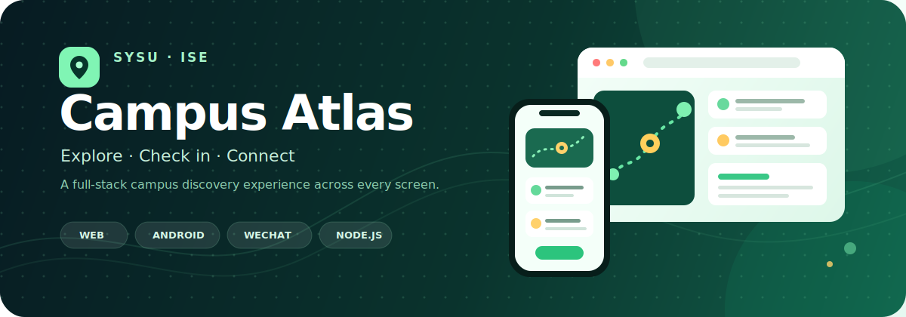
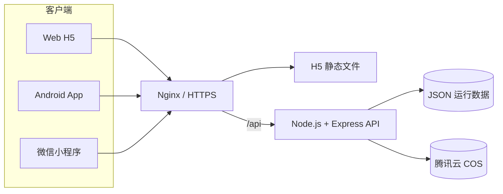

<p align="center">
  
</p>

<h1 align="center">SYSU ISE Campus Atlas Fullstack</h1>

<p align="center">
  <strong>中山大学智能工程学院校园图鉴 · 全端源码仓库</strong><br />
  一套同时运行在 Web、Android 与微信小程序上的校园探索、打卡和互动平台。
</p>

<p align="center">
  <a href="https://hiwebsun.top"></a>
  
  
  
  
</p>

<p align="center">
  <a href="#quick-start"><strong>快速开始</strong></a> ·
  <a href="#project-map">项目地图</a> ·
  <a href="#other-clients">运行其他客户端</a> ·
  <a href="#deployment">部署指南</a> ·
  <a href="#faq">常见问题</a>
</p>

> [!TIP]
> **第一次接触全栈项目？** 不用一次理解所有目录。先按“5 分钟跑起来”启动后端和 Web，看到页面后再研究小程序、Android 和 Nginx。

## 这个项目能做什么？

| | |
| --- | --- |
| 🗺️ **校园图鉴**<br />浏览校园地点、相册与地图 | 📍 **校园打卡**<br />提交图片、记录进度、查看历史 |
| 🏆 **打卡排行榜**<br />按用户打卡进度生成排名 | 🪁 **漂流瓶互动**<br />投放、抽取和管理校园漂流瓶 |
| 🔐 **账号系统**<br />注册、登录、JWT 身份认证 | 🛡️ **管理审核**<br />用户、打卡记录与漂流瓶管理 |
| 🖼️ **云端图片**<br />腾讯云 COS 头像和打卡图片 | 📱 **多端共用**<br />Web、Android、小程序共享后端 API |

### 我应该从哪里开始？

| 你的目标 | 建议入口 |
| --- | --- |
| 只想看看成品 | 打开 [在线体验](https://hiwebsun.top) |
| 第一次运行项目 | 直接阅读 [5 分钟跑起来](#quick-start) |
| 只修改网页 | `apps/web-h5/` |
| 开发微信小程序 | [微信小程序说明](#wechat-mini-program) |
| 打包 Android APK | [Android 说明](#android-app) |
| 部署到自己的服务器 | [部署指南](#deployment) |

<a id="project-map"></a>

## 项目地图

```text
SYSU_ISE_Campus_Atlas_Fullstack/
│
├─ apps/
│  ├─ web-h5/                 # Vue 3 网页端（新手建议先看这里）
│  ├─ android/                # Vue 3 + Capacitor Android 工程
│  └─ wechat-miniprogram/     # 微信小程序与云函数
│
├─ services/
│  └─ weapp-auth-server/      # Node.js / Express 后端 API
│
├─ deploy/
│  ├─ nginx/                  # 服务器 Nginx 配置快照
│  └─ web-h5-dist/            # 服务器当前 H5 部署快照
│
├─ .gitignore                 # 统一排除依赖、密钥、日志和运行数据
└─ README.md                  # 你正在阅读的文件
```

### 各部分之间是什么关系？



### 技术栈

| 层级 | 使用的技术 | 作用 |
| --- | --- | --- |
| Web | Vue 3、Vue Router、Vite | 页面与浏览器端交互 |
| Android | Capacitor 8、Gradle | 将 Vue 应用封装为 Android App |
| 小程序 | 微信小程序原生框架、云函数 | 微信客户端体验 |
| 后端 | Node.js、Express、JWT、bcryptjs | API、认证与业务逻辑 |
| 文件存储 | 腾讯云 COS、STS | 头像和打卡图片 |
| 网关 | Nginx、HTTPS | 静态站点、反向代理与缓存 |

<a id="quick-start"></a>

## 🚀 5 分钟跑起来

最短路径只需要启动两个部分：**Node.js 后端 + Web H5**。

### 0. 安装必备工具

请先安装：

- [Git](https://git-scm.com/downloads)
- [Node.js](https://nodejs.org/) 22 或更高版本
- 一个代码编辑器，例如 [Visual Studio Code](https://code.visualstudio.com/)

打开 PowerShell，确认安装成功：

```powershell
git --version
node --version
npm --version
```

`node --version` 应显示 `v22` 或更高版本。

### 1. 下载项目

```powershell
git clone https://github.com/hiwebsun0914/SYSU_ISE_Campus_Atlas_Fullstack.git
cd SYSU_ISE_Campus_Atlas_Fullstack
```

### 2. 启动后端

在当前 PowerShell 中执行：

```powershell
cd services\weapp-auth-server
npm install
Copy-Item .env.example .env
npm start
```

看到类似下面的内容，说明后端已启动：

```text
Server running at http://0.0.0.0:3000
```

打开 <http://localhost:3000/health>，如果看到下面的 JSON 就成功了：

```json
{
  "ok": true,
  "time": 1234567890
}
```

> [!IMPORTANT]
> 这个 PowerShell 窗口要保持运行。按 `Ctrl + C` 可以停止后端。

### 3. 启动 Web 页面

再打开一个新的 PowerShell 窗口，进入刚才克隆的项目，然后执行：

```powershell
cd apps\web-h5
npm install
Copy-Item .env.example .env.local
npm run dev
```

打开 <http://localhost:8080>。现在你应该能看到校园图鉴页面。

### 4. 第一次运行检查表

- [ ] `http://localhost:3000/health` 能显示 `ok: true`
- [ ] `http://localhost:8080` 能打开页面
- [ ] 两个 PowerShell 窗口都没有红色报错
- [ ] 浏览器开发者工具中没有网络连接失败

<details>
<summary><strong>我使用 macOS / Linux，命令有什么不同？</strong></summary>

只有复制配置文件的命令不同：

```bash
cp .env.example .env
cp .env.example .env.local
```

路径使用 `/`，例如 `cd services/weapp-auth-server`。其他 npm 命令相同。

</details>

## 环境配置：哪些必须填？

### 后端 `services/weapp-auth-server/.env`

| 配置项 | 本地运行 | 说明 |
| --- | --- | --- |
| `PORT` | 可选 | 后端端口，默认 `3000` |
| `JWT_SECRET` | **必须修改** | JWT 签名密钥，生产环境必须使用长随机字符串 |
| `COS_BUCKET` | 图片功能需要 | 腾讯云 COS Bucket 名称 |
| `COS_REGION` | 图片功能需要 | 例如 `ap-guangzhou` |
| `PUBLIC_ASSET_DOMAIN` | 推荐 | 图片公开访问域名 |
| `COS_SECRET_ID/KEY` | 图片功能需要 | 腾讯云访问密钥 |
| `TENCENT_SECRET_ID/KEY` | 图片功能需要 | 当前部分路由使用的同一套腾讯云密钥 |

生成随机 `JWT_SECRET` 的简单方法：

```powershell
node -e "console.log(require('crypto').randomBytes(32).toString('hex'))"
```

把输出复制到 `.env` 的 `JWT_SECRET=` 后面。**不要把真实 `.env` 上传到 GitHub。**

> [!NOTE]
> 不配置 COS 也能学习项目结构和测试部分基础接口；头像、打卡图片及图片签名相关功能需要完整的 COS 配置。

### Web `apps/web-h5/.env.local`

```dotenv
# 本地后端
VITE_API_BASE=http://localhost:3000

# 生产环境经过 Nginx 反代
# VITE_API_BASE=/api
```

<a id="other-clients"></a>

## 运行其他客户端

建议先确保 Web 和后端能正常运行，再继续下面的内容。

<a id="wechat-mini-program"></a>

### 微信小程序

需要先安装 [微信开发者工具](https://developers.weixin.qq.com/miniprogram/dev/devtools/download.html)。

1. 打开微信开发者工具，点击“导入项目”。
2. 选择仓库中的 `apps/wechat-miniprogram/`。
3. 检查 `project.config.json` 的 `appid`；没有该 AppID 权限时请换成自己的。
4. 在 `apps/wechat-miniprogram/` 执行 `npm install`。
5. 在开发者工具中点击“工具 → 构建 npm”。
6. 修改 `miniprogram/utils/request.js` 中的 `API_BASE`，指向你的后端地址。

> [!WARNING]
> 正式小程序必须使用已经在微信公众平台登记的 HTTPS 合法域名。本地关闭域名校验只适合开发调试。

<a id="android-app"></a>

### Android App

需要安装 Android Studio、Android SDK，并使用 Node.js 22+。

```powershell
cd apps\android
npm install
Copy-Item .env.example .env.local
npm run cap:sync
npm run android:open
```

在 `.env.local` 中把 `VITE_NATIVE_API_BASE` 改成手机能访问的完整 HTTPS API 地址。手机里的 `localhost` 指手机自己，并不是开发电脑。

常用命令：

| 命令 | 用途 |
| --- | --- |
| `npm run dev` | 先在浏览器调试 Android 对应的 Vue 页面 |
| `npm run cap:sync` | 构建 Web，并同步到 Android 工程 |
| `npm run android:open` | 用 Android Studio 打开工程 |
| `npm run apk:debug` | 生成 Debug APK |

Debug APK 通常生成在：

```text
apps/android/android/app/build/outputs/apk/debug/app-debug.apk
```

每次修改 Vue 源码后，都要重新运行 `npm run cap:sync`。正式发布还需要在 Android Studio 中配置自己的签名文件，签名文件和密码不能提交到 Git。

## 常用开发命令

| 工作目录 | 命令 | 说明 |
| --- | --- | --- |
| `services/weapp-auth-server` | `npm start` | 启动后端 API |
| `apps/web-h5` | `npm run dev` | 启动 Web 开发服务器 |
| `apps/web-h5` | `npm run build` | 生成 Web 生产文件 |
| `apps/web-h5` | `npm run preview` | 预览生产构建 |
| `apps/android` | `npm run cap:sync` | 同步 Android Web 资源 |
| `apps/android` | `npm run apk:debug` | 构建 Debug APK |

<a id="deployment"></a>

## 部署指南

<details>
<summary><strong>1. 部署 Web H5</strong></summary>

在 `apps/web-h5/` 中创建生产配置：

```dotenv
VITE_API_BASE=/api
```

构建：

```bash
npm install
npm run build
```

将新生成的 `dist/` 内容上传到服务器 `/www/web-h5/dist/`。

`deploy/web-h5-dist/` 是整理仓库时服务器上的部署快照，用来参考和回溯；日常开发应修改 `apps/web-h5/src/`，不要直接编辑压缩后的快照文件。

</details>

<details>
<summary><strong>2. 部署 Node.js 后端</strong></summary>

将 `services/weapp-auth-server/` 上传到服务器，然后：

```bash
cd /root/weapp-auth-server
cp .env.example .env
# 编辑 .env，填写生产密钥
npm install --omit=dev
npm start
```

生产环境建议使用 systemd 或 PM2 管理进程，不要依赖一个长期打开的 SSH 窗口。

</details>

<details>
<summary><strong>3. 配置 Nginx</strong></summary>

`deploy/nginx/` 是当前服务器 `/etc/nginx/` 的配置快照，其中包含当前域名、证书路径和站点目录。迁移到其他服务器时应按实际环境修改，**不要直接覆盖整个 `/etc/nginx/`**。

每次改动后先检查，再平滑重载：

```bash
sudo nginx -t
sudo systemctl reload nginx
```

</details>

## 数据与安全

仓库已经通过 `.gitignore` 排除以下内容：

- `node_modules`、Gradle 缓存、构建缓存和普通 `dist/`
- 真实 `.env`、腾讯云密钥、JWT 密钥和证书私钥
- Android 签名文件与本机 SDK 路径
- 服务器访问日志
- `users.json`、`checkins.json`、`bottles.json` 等真实运行数据
- 微信开发者工具私人配置和 IDE 配置

后端当前使用 JSON 文件存储部分业务数据，适合教学、演示和小规模活动。若用于长期生产或高并发场景，建议迁移到正式数据库，并做好备份、权限控制和并发写入保护。

<a id="faq"></a>

## 常见问题

<details>
<summary><strong>运行 npm 命令时报 “node 版本不支持”</strong></summary>

执行 `node --version`。Android 子项目使用 Capacitor 8，需要 Node.js 22 或更高版本。升级 Node.js 后删除当前子项目的 `node_modules`，再运行 `npm install`。

</details>

<details>
<summary><strong>页面能打开，但所有接口都失败</strong></summary>

按顺序检查：

1. `http://localhost:3000/health` 是否正常。
2. Web 的 `.env.local` 是否为 `VITE_API_BASE=http://localhost:3000`。
3. 修改 `.env.local` 后是否重启了 `npm run dev`。
4. 浏览器开发者工具的 Network 和 Console 中是否有 CORS 或连接错误。

</details>

<details>
<summary><strong>登录能用，但头像或打卡图片上传失败</strong></summary>

检查后端 `.env` 中的 COS Bucket、Region、资源域名和两组密钥。当前不同路由分别使用 `COS_SECRET_*` 与 `TENCENT_SECRET_*`，因此两组变量应填写同一套腾讯云凭据。

</details>

<details>
<summary><strong>Android 页面正常，但请求不到后端</strong></summary>

`VITE_NATIVE_API_BASE` 必须是手机能访问的完整 HTTPS 地址。修改后重新运行 `npm run cap:sync`，再从 Android Studio 启动应用。

</details>

<details>
<summary><strong>微信开发者工具提示域名不合法</strong></summary>

在微信公众平台配置 request、uploadFile、downloadFile 合法域名，并确保证书有效。开发工具中的“忽略域名校验”只用于本地调试。

</details>

## 当前验证状态

打包本仓库时已完成：

- ✅ Web H5 生产构建
- ✅ Android Web 构建与 Capacitor 同步
- ✅ Node.js 后端语法检查与 `/health` 冒烟测试
- ✅ 微信小程序 JavaScript 语法检查
- ✅ 提交内容秘密与敏感文件检查

---

<p align="center">
  如果这个项目帮助你理解了一个多端全栈项目，欢迎点亮 ⭐ Star。<br />
  <sub>Built for campus discovery, shared learning and joyful exploration.</sub>
</p>

