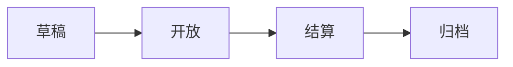

# 迎新活动分届管理说明书（审阅稿）

> 适用项目：中山大学智能工程学院校园图鉴
>
> 对应需求：GitHub Issue #53
>
> 文档状态：本地开发审阅稿，尚未执行生产迁移、归档或开启下一届

## 1. 为什么要做分届管理

迎新活动每年都会产生一批新的打卡、积分、路线、投稿、投票和获奖数据。如果继续把所有年份的数据放在一起，会出现以下问题：

- 新一届开始后，上一届学生可能继续使用旧积分或参与新一届投票。
- 新规则可能改变旧活动的排名和获奖结果。
- 管理员难以确认正在处理哪一届的审核记录。
- 换届时直接清空用户数据，会误删账号资料和历史记录。

本次修改将“长期账号”和“每届活动数据”分开保存。用户账号一直保留，但活动数据严格按照届次隔离。

## 2. 最重要的使用规则

### 2.1 普通用户固定属于一届

每个普通用户账号都有一个不可由用户修改的“新生届次”，数据字段为：

```json
{
  "participantSeasonId": "2026-welcome"
}
```

例如，2026 级新生账号绑定 `2026-welcome` 后：

- 2026 年活动期间，可以参加当年的打卡、投稿和投票。
- 2026 年活动结束后，仍可以查看自己的 2026 年记录。
- 2027 年活动开启后，账号不会自动切换到 2027 年。
- 页面不会向该账号提供 2027 年活动选择。
- 即使手动修改网址、请求参数或请求头，也不能读取或操作 2027 年活动数据。

服务端遇到普通用户跨届访问时，会返回：

```text
SEASON_NOT_VISIBLE：该活动期不属于你的新生届次
```

因此，普通用户界面中的“活动期选择”实际只会显示自己所属的一届；只有管理员可能看到多届选项。

### 2.2 “属于这一届”和“能参加什么”分开控制

账号绑定届次后，还需要审批其具体活动能力：

| 能力 | 作用 |
| --- | --- |
| `checkin` | 允许打卡和提交打卡审核 |
| `submit` | 允许投稿和处理自己的投稿 |
| `vote` | 允许给本届作品投票 |

用户必须同时满足以下两个条件才能参与：

1. 请求的活动届次与账号绑定届次一致。
2. 账号拥有对应能力。

例如，2027 级新生匹配当年花名册后获得三项能力；名单外申请者经超管批准后只获得打卡能力，不能投稿或投票。

具体规则已经确定：

| 人员类型 | 打卡 | 投稿 | 投票 |
| --- | --- | --- | --- |
| 匹配活动范围内花名册的当级新生 | 允许 | 允许 | 允许 |
| 名单外、经超管批准的参与者 | 允许 | 不允许 | 不允许 |
| 未匹配花名册且未经批准的申请者 | 不允许 | 不允许 | 不允许 |

花名册核对要求姓名和学号匹配同一条记录；名单外申请只能由超管批准。

用户不能通过前端缓存、修改请求或切换活动期自行获得能力。最终判断均由服务端完成。

### 2.3 管理员可以跨届管理

普通管理员和超管需要处理历史审核、归档和换届，因此不受普通用户的单届查看限制。

- 普通管理员：按照权限处理审核事项。
- 超管：创建活动草稿、修改规则、结算、归档和开启下一届。
- 管理员跨届查看不会改变其账号身份，也不会把管理员变成该届参与者。

## 3. 哪些数据长期保留，哪些数据按届保存

### 3.1 长期账号数据

以下内容属于账号本身，换届时不清空：

- 用户 ID、用户名和登录凭据
- 姓名、学号、手机号、个人简介和头像
- 角色和管理员权限
- 性格测试结果
- 未来寄语
- 账号绑定的新生届次

未来寄语继续按照原有约定展示，不随迎新活动归档或换届重置。

### 3.2 每届独立保存的数据

以下内容以 `seasonId + userId` 隔离：

- 积分和积分达到时间
- 已解锁地点和完成路线
- 打卡、审核、驳回和申诉记录
- 投稿、投票和每日投票限额
- 获奖记录和最终排名
- 地点、路线、积分、截止时间、公布时间和奖项规则

新一届创建后，上述数据从空状态开始，不复制上一届进度。

## 4. 用户在页面上会看到什么

### 普通用户

- 顶部显示自己所属活动的名称。
- “我的活动记录”页面只展示本人所属届次。
- 可以查看当届积分、打卡、路线、投稿和已公布的获奖结果。
- 活动结算或归档后，页面会标明只读。
- 不显示其他届次的选择入口。

Web、Android 和微信小程序采用同一规则。客户端缓存按照“账号 + 届次”隔离；登录账号发生变化时，会重新读取该账号绑定的届次。

### 管理员

- 可以选择不同届次查看管理数据。
- 可以查看活动状态和未处理事项。
- 可以预览归档内容。
- 超管可以执行状态转换和换届操作。

### 未登录访客

原本允许公开访问的当届介绍、公开榜单或公开作品仍可按产品现有规则展示。个人记录、投票、投稿和打卡必须登录。若希望往届学生即使退出登录也不能浏览新一届公开作品，需要进一步将这些公开页面改为仅对当届账号开放；这是产品公开范围的选择，与账号跨届隔离是两个不同层面。

## 5. 活动生命周期

每届活动依次经过以下状态：



### 草稿

- 仅管理员可见。
- 超管填写日期、地点、路线、积分和奖项规则。
- 导入并复核当届参与账号及能力。

### 开放

- 符合资格的当届用户可以打卡、投稿和投票。
- 各项行为仍受截止时间、投票限额等规则约束。

### 结算

- 禁止产生新的打卡、投稿、投票和申诉。
- 管理员可以继续处理截止前已经提交的审核和申诉。
- 存在未处理事项时不能归档。

### 归档

- 冻结排行榜、路线统计、获奖结果和活动配置。
- 用户只能查看，不能再修改。
- 管理端修改、删除和自动评奖同样会被拒绝。

上一届完成归档后，超管才能把下一届切换为当前活动。

## 6. 换届操作流程

建议管理员严格按照以下顺序操作：

1. 为下一届创建草稿，例如 `2027-welcome`。
2. 填写并复核活动日期、路线、地点、积分和奖项规则。
3. 通过 #59 对新生身份进行审批，并将账号绑定到该届。
4. 为通过审批的账号配置打卡、投稿和投票能力。
5. 将上一届转入结算，完成所有待审核和申诉事项。
6. 生成完整备份，在隔离目录完成恢复演练。
7. 归档上一届，冻结结果。
8. 人工复核管理员名单。
9. 开启下一届。

如果任何检查失败，系统保持原当前届，不会完成切换。

### 超管导入花名册

超管在活动期管理页选择处于“草稿”状态的新活动后，可以直接选择花名册并点击“导入花名册”。

- 支持 `.xlsx` 和 UTF-8 编码的 `.csv` 文件，最大 5MB、10000 人。
- 系统读取第一个 Excel 工作表，自动识别“姓名、学号、入学年份、学院”列，也兼容常见英文列名。
- 入学年份必须与活动标识开头的年份一致，例如 `2027-welcome` 只接受 2027 级记录。
- 空白必填项、无效学号、重复学号或错误年份都会导致整次导入失败，原花名册保持不变。
- 重新导入会完整替换该草稿活动的上一份花名册。
- 活动开放后不能再导入或替换花名册。
- 页面只显示人数、学院统计、导入时间和文件校验值，不返回学生明细；花名册文件和解析结果不会进入 Git。
- 每次成功导入都会记录活动期、超管账号、时间、人数和 SHA-256 校验值。

## 7. 迁移现有 2026 数据

迁移工具默认只做预览，不直接修改数据。正式执行后：

- 现有账号、打卡、积分、投稿和投票归入 `2026-welcome`。
- 现有普通账号绑定到 `2026-welcome`。
- 原始文件继续保留。
- 迁移重复运行不会重复计分或复制记录。
- 2026 年活动先进入“结算”状态，不会自动归档。
- 不会根据本地 Excel 榜单重新生成结果。

两个本地榜单文件继续排除在 Git 仓库之外。

## 8. 数据写入和损坏保护

后端所有活动数据统一经过存取层处理：

- 同一时间串行处理写请求。
- 先写临时文件，再原子替换正式文件。
- 多文件修改使用事务日志恢复。
- 数据文件损坏时明确报错，不会把损坏数据当作空数组覆盖。
- 归档数据拒绝任何业务写入。

当前 JSON 方案只允许后端单实例写入。不能让多个后端实例同时共享并修改同一数据目录。

## 9. 备份、恢复和图片

完整备份覆盖：

- 长期账号
- 未来寄语
- 全部活动届次及注册表
- 反馈和配置
- 打卡、投稿等图片对象
- 文件数量、大小和 SHA-256 校验信息

恢复时先写入一个新的隔离目录，验证 JSON、记录关联和图片对象全部可恢复后，才允许正式切换。回滚时必须同时恢复匹配的数据、图片和代码版本。

系统默认不自动删除历史数据或图片。没有配置保留期限的数据类别禁止自动清理；清理前只生成预览，并检查跨届引用和未来寄语引用。

## 10. 与 #52、#59 的关系

- **#53 本次修改**：负责活动分届、数据隔离、生命周期、归档、备份恢复和多端适配。
- **#59 注册审批**：负责判断申请者是否为当届新生，并写入账号绑定届次及具体活动能力。
- **#52 数据库治理**：负责后续从单实例 JSON 方案迁移到更适合长期运营的数据基础设施。

#59 落地时必须遵守以下约束：普通账号只能绑定一个新生届次，不能因为下一年仍然保留账号而自动取得新一届资格。

## 11. 已完成的自动验证

本地实现目前通过以下检查：

- 后端自动化测试 108 项全部通过。
- Web 自动化测试 19 项全部通过。
- Web 生产构建通过。
- Android 生产构建通过。
- 微信小程序相关 JavaScript 语法检查通过。
- Git 差异格式检查通过。

测试覆盖了旧生访问新届被拒绝、跨届对象访问、重复迁移、并发审核、归档后写入、备份恢复和损坏文件保护等场景。

## 12. 本次审阅需要确认的事项

以下产品规则已经确认：

1. 普通账号永久只绑定一个新生级别对应的活动期。
2. 管理员继续保留跨活动期查看和处理权限。
3. 匹配花名册的当级新生默认拥有打卡、投稿和投票能力。
4. 名单外申请者经超管批准后只有打卡能力，没有投稿和投票能力。
5. 现有全部账号统一视为 2026 级参与者，迁移到 `2026-welcome`，不在本次迁移前清理。

仍需确认的产品规则：未登录访客是否可以查看当前活动期的公开榜单和公开作品。

## 13. 当前实施状态

代码和测试均位于本地工作区，尚未提交到 GitHub，也尚未部署到 `sysuzgxytj.top`。目前没有执行以下生产操作：

- 没有迁移线上 JSON 数据。
- 没有归档 2026 年迎新活动。
- 没有创建或开启 2027 年迎新活动。
- 没有更改线上图片对象。

完成本文审阅并确定上述产品规则后，再安排代码提交、生产备份、迁移预览和上线。
